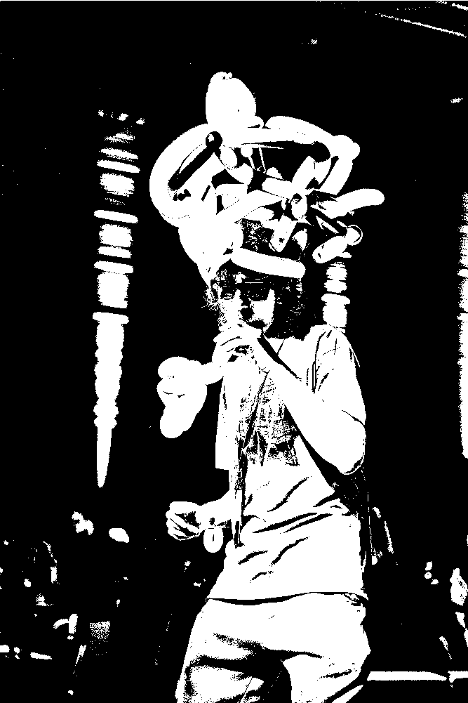
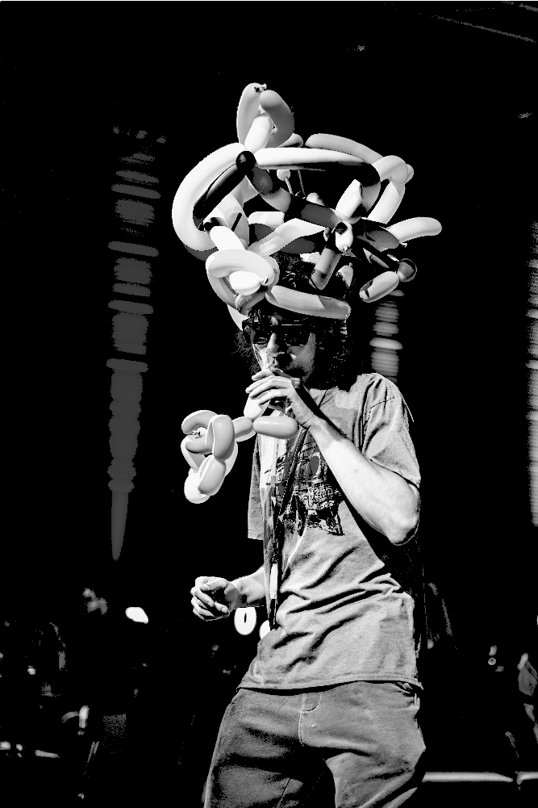
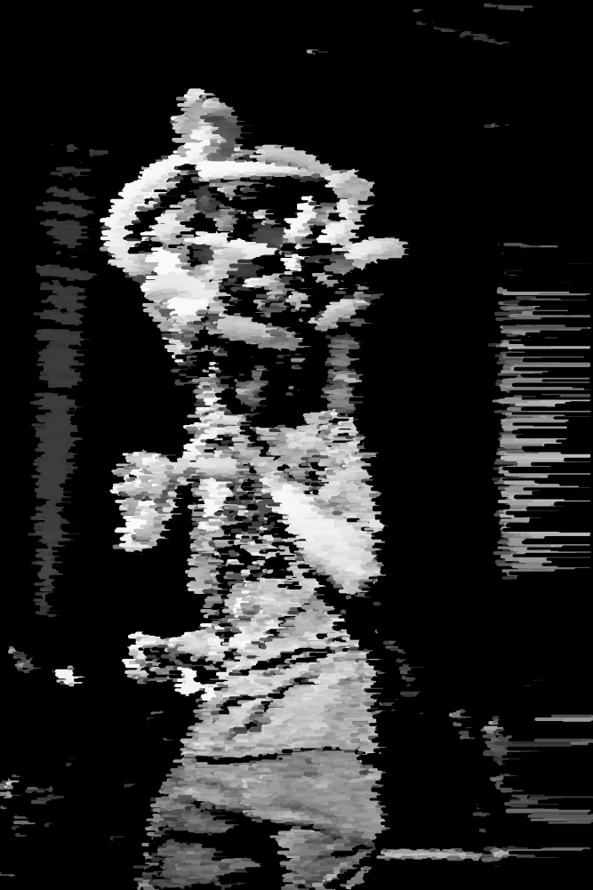

# Creating a filter for images using p5js

## _showing the image_

### _1. pre-load your image image_

```js
let img;

function preload() {
    img = loadImage("./loic.png");
}
```

### _2. create a the size of your image_

```js
function setup() {
    createCanvas(img.width, img.height);
}
```

### _3. draw your image by changing the canvas pixels color value_

#### _load both of the pixels array_

```js
function setup() {
    // ...

    img.loadPixels();
    loadPixels();
}
```

#### _loop through the pixels array based on the width & height_

```js
function setup() {
    // ...

    for (let x = 0; x < width; x++) {
        for (let y = 0; y < height; y++) {
            // ...
        }
    }
}
```

#### _get the index of the pixel using the density of pixels_

```js

function setup() {
    // ...
    let d = pixelDensity();

    for (let x = 0; x < width; x++) {
        for (let y = 0; y < height; y++) {
            let index = 4 * ((d + y) * width * d + (d + x));
            // ...
        }
    }
}
```

#### _get the r, g, b and a value of the pixel of the image_

```js
function setup() {
    // ...
    let d = pixelDensity();

    for (let x = 0; x < width; x++) {
        for (let y = 0; y < height; y++) {
            let index = 4 * ((d + y) * width * d + (d + x));
            let r = img.pixels[index];
            let g = img.pixels[index + 1];
            let b = img.pixels[index + 2];
            let a = img.pixels[index + 3];
            // ...
        }
    }
}
```

#### _change the color of the pixel of the canvas_

```js
function setup() {
    // ...
    let d = pixelDensity();

    for (let x = 0; x < width; x++) {
        for (let y = 0; y < height; y++) {
            let index = 4 * ((d + y) * width * d + (d + x));
            let r = img.pixels[index];
            let g = img.pixels[index + 1];
            let b = img.pixels[index + 2];
            let a = img.pixels[index + 3];

            pixels[index] = r;
            pixels[index + 1] = g;
            pixels[index + 2] = b;
            pixels[index + 3] = a;
        }
    }
}
```

#### _update the canvas pixels_

```js
function setup() {
    // ...
    let d = pixelDensity();

    for (let x = 0; x < width; x++) {
        for (let y = 0; y < height; y++) {
            let index = 4 * ((d + y) * width * d + (d + x));
            let r = img.pixels[index];
            let g = img.pixels[index + 1];
            let b = img.pixels[index + 2];
            let a = img.pixels[index + 3];

            pixels[index] = r;
            pixels[index + 1] = g;
            pixels[index + 2] = b;
            pixels[index + 3] = a;
        }
    }

    updatePixels();
}
```

## _adding a chromatic effect/filter to the render_


### _1. create a variable to store the chromatic value_

#### _value calculated by using the brightness of the pixels, so to result 1 values from 3 (r, g, b) we must calculate the average of the 3 values_

```js
const cumulative = (r + g + b) / 3;
```

#### _update the existing code within the loops to use the new chromatic value for each of the rgb channel_

```js
let img;

function preload() {
    img = loadImage('loic.jpg');
}

function setup() {
    createCanvas(img.width, img.height);
    
    img.loadPixels();
    loadPixels();
    
    let d = pixelDensity();

    for (let x = 0; x < width; x++) {
        for (let y = 0; y < height; y++) {
            let index = 4 * ((d + y) * width * d + (d + x));
            let r = img.pixels[index];
            let g = img.pixels[index + 1];
            let b = img.pixels[index + 2];
            let a = img.pixels[index + 3];

            let cumulative = (r + g + b) / 3;

            pixels[index] = cumulative;
            pixels[index + 1] = cumulative;
            pixels[index + 2] = cumulative;
            pixels[index + 3] = a;
        }
    }

    updatePixels();
}
```


### _3. add a threshold at which the pixel will be either black or white _


```js
// 0 = black
// 255 = white

cumulative = cumulative > 150 ? 255 : 0;
```



### _4. smoothen the bright part of the threshold by mapping it's original values to a given range_

```js
cumulative = cumulative > 150 ? map(cumulative, 150, 255, 50, 255) : 0;
```

#### _which will result in a clearer image_



## _now lets make the image be "glitched"_

#### _now instead of setting a value to each canvas pixels directly, lets create points and draw those with the proper color_

```js
function setup() {
    // ...

    loadPixels(); // line removed

    for (let x = 0; x < width; x++) {
        for (let y = 0; y < height; y++) {
            // ...

            stroke(cumulative, a);
            point(x, y);

            pixels[index] = cumulative; // line removed
            pixels[index + 1] = cumulative; // line removed
            pixels[index + 2] = cumulative; // line removed
            pixels[index + 3] = a; // line removed
        }
    }
    
    updatePixels(); // line removed
}
```

#### _add a bit of randomness to the size of the points_

```js
function setup() {
    // ...

    for (let x = 0; x < width; x++) {
        for (let y = 0; y < height; y++) {
            // ...

            strokeWeight(random(3, 5));
            stroke(cumulative, a);
            point(x, y);
        }
    }
}
```

#### _change the points to lines and set the second x to the current x + a random amount_

```js
const lineHalfMaxLength = 100;

function setup() {
    // ...
    
    for (let x = 0; x < width; x++) {
        for (let y = 0; y < height; y++) {
            // ...

            strokeWeight(random(3, 5));
            stroke(cumulative, a);
            line(x, y, x + random(-lineHalfMaxLength, lineHalfMaxLength), y);
            point(i, j); // line removed
        }
    }
}
```


